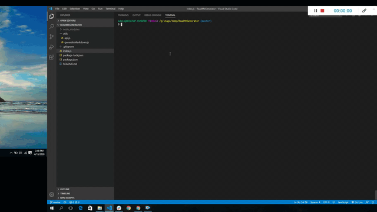

# README Generator

https://sujatha-m.github.io/ReadMeGenerator/

## Table of Contents
   * [Description](#description)
   * [Usage](#usage)
   * [Installation](#installation)
   * [Badges](#badges)
   * [Contributing](#contributing)
   * [License](#license)
   * [Visuals](#visuals)

## Description

A command-line application that dynamically generates a ReadMe file based on a user's input.

The application is intended to automate the process of creating a ReadMe file for any new project.

It does this by prompting the user with a series of questions and using the answers to create sections like project title,
deployed application url,description,table of contents,badges,installation,usage,contributing,tests,license followed by 
user's github profile image along with email address within the generated ReadMe file.

The application has been implemented using Node.js and makes use of dependant modules like inquirer(to get user inputs and process them),
filesystem(to write readme data to a file) and axios to make calls into the github API to fetch data for a specified github 
username.

The implementation has been modularized across 3 files index.js,api.js and generateMarkdown.js.
The functions in api.js and generateMarkdown.js are exported as modules to be imported by index.js to carry on the overall
functionality.

## Badges
[](https://img.shields.io/github/followers/sujatha-m?style=social)
[](https://img.shields.io/website?url=https%3A%2F%2Fsujatha-m.github.io%2FWeather-Dashboard%2FDevelop%2F)


## Visuals



## Installation 
Run the command "npm install" to install all the required node modules for this project (defined in package.json)

## Usage
```sh
node index.js
```

## Contributing
Pull requests are welcome. For major changes, please open an issue first to discuss what you would like to change.
Please make sure to update tests as appropriate.

## License 
[MIT](https://choosealicense.com/licenses/mit/)

## Questions
# 

jhanavi.bhushan@gmail.com
	